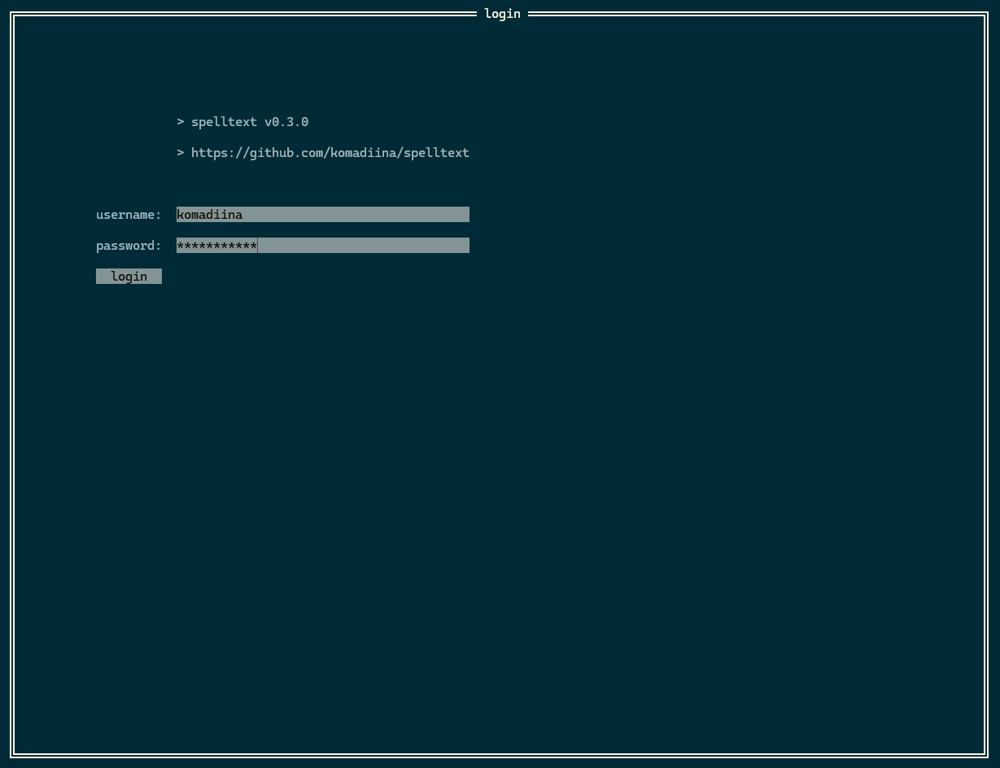

# spelltext


command-line interface based mmorpg (derives *spell* from mmorpg **spells**, *text* because it's, well, *text-based*). uses [tview](https://github.com/rivo/tview) as the graphical interface. started as a [bachelor's thesis/project](https://efee.etf.unibl.org/vector/zavrsni-radovi/2520) of mine, relying on the Kubernetes orchestration & containerization concepts, as well as high-availability and consistency-related prerequisites.

## contents
- [spelltext](#spelltext)
  - [contents](#contents)
  - [usage](#usage)
    - [client](#client)
      - [visual examples](#visual-examples)
    - [server](#server)
      - [`docker`](#docker)
      - [`kubernetes`](#kubernetes)
      - [example - accessing pods/servers](#example---accessing-podsservers)
      - [example - cleaning up](#example---cleaning-up)
  - [components](#components)
  - [todo:](#todo)
## usage
requirements:
- go `1.25.0` toolchain (possibly compatible with `1.24.x`)
- docker `28.3.2` (tested on build rev. `578ccf6`)
- (opt) minikube `1.35.0` (compatible with `1.33.0`)
- (opt) helm `3.19.0` (goVersion: `1.24.7`)

### client
(*as of 25th sept.*): to run a single client, simply run:
```sh
$ set CLIENT_USERNAME=john_doe

$ cd $PROJECT_DIR/client
$ go run client.go --username=$CLIENT_USERNAME
```

#### visual examples


### server
#### `docker`
using the [composefile](./compose.yml) you can seamlessly deploy a simple service composition:
```sh
# navigate to project root dir
$ cd $PROJECT_ROOT

# start up `docker compose`
$ docker compose up --watch --force-recreate --build 

# ...

# make sure to docker compose down (can cause duplicated stdout if not done)
$ docker compose down -v --remove-orphans
```
  
#### `kubernetes`
deployed using the [provided charts](https://github.com/komadiina/spelltext/tree/main/k8s/) in the repo and [hosted packages](https://github.com/komadiina/spelltext/pkgs/container/spelltext%2Fchatserver).
```sh
# start up minikube (or k3s, microk8s, gke, ...)
$ minikube start

# navigate to project root dir
$ cd $PROJECT_ROOT

# create the 'spelltext' kube namespace
$ kubectl create ns spelltext

# a) install pre-generated helm charts
$ helm install spelltext k8s/postgresql-ha/ -n spelltext
$ helm upgrade spelltext k8s/spelltext/ -n spelltext

# b) or alternatively:
$ helm install spelltext k8s/postgresql-ha/ -n spelltext --create-namespace
$ helm upgrade spelltext k8s/spelltext/ -n spelltext

# output should look something like this:
> NAME: spelltext
> LAST DEPLOYED: Thu Sep 25 20:48:01 2025
> NAMESPACE: spelltext
> STATUS: deployed
> REVISION: 1
> TEST SUITE: None

# (confirm) set current kubectl namespace to 'spelltext'
$ kubectl config set-context --current --namespace=spelltext
```

#### example - accessing pods/servers
if you wish to access the deployment replicas via `ClusterIP` CRD from the host, you can do so:
- a) with the `kubectl port-forward` command (per-pod) (this is useful when testing `nats (nats://spelltext-nats:4222)` locally, against host):
```sh
# from the 'spelltext' namespace
$ kubectl get pods
> NAME                          READY   STATUS    RESTARTS   AGE
> chatserver-67bfcfdbd5-mlp7j   1/1     Running   0          4m
> chatserver-67bfcfdbd5-t7qvj   1/1     Running   0          4m

$ kubectl get svc
> NAME         TYPE        CLUSTER-IP       EXTERNAL-IP   PORT(S)     AGE
> chatserver   ClusterIP   10.106.245.161   <none>        50051/TCP   4m17s

# this isn't daemon-ized, unless you multiplex your terminal (smth like tmux)
$ kubectl port-forward pods/chatserver-67bfcfdbd5-mlp7j 50051:50051
> Forwarding from 127.0.0.1:50051 -> 50051
> Forwarding from [::1]:50051 -> 50051

$ |
```

- b) via exposing service external-ip and minikube tunnel:
```sh
# start the tunnel
$ minikube tunnel

# select the service you want to dial 
# use chart/templates/TEMPLATE.yaml:.spec.selector.matchLabels.app, e.g. 'chatserver'
$ export SERVICE_NAME=chatserver

$ kubectl get deployments $SERVICE_NAME
> NAME         READY   UP-TO-DATE   AVAILABLE   AGE
> chatserver   2/2     2            2           7m54s

# expose the deployment via a loadbalancer
$ kubectl expose deployment chatserver --type=LoadBalancer --name=chatserver-lb

# external-ip is displayed now, with the help of 'minikube tunnel' command
$ kubectl get svc
> NAME            TYPE           CLUSTER-IP       EXTERNAL-IP     PORT(S)           AGE
> chatserver      ClusterIP      10.106.245.161   <none>          50051/TCP         16m
> chatserver-lb   LoadBalancer   10.108.13.46     10.96.184.178   50051:32671/TCP   4m33s
```

#### example - cleaning up
cleanup:
```sh
$ helm uninstall spelltext
$ kubectl delete ns spelltext
```

## components


```bash
# directory structure (sep 25th)
.
├───client
│   ├───config
│   ├───factory
│   ├───functions
│   ├───registry
│   ├───types
│   └───views
├───docs
│   ├───chat
│   └───inventory
├───k8s
│   ├───postgresql-ha
│   │   ├───charts
│   │   │   └───common
│   │   │       └───templates
│   │   │           └───validations
│   │   └───templates
│   │       ├───backup
│   │       ├───pgpool
│   │       └───postgresql
│   └───spelltext
│       ├───charts
│       └───templates
├───proto
│   ├───chat
│   └───inventory
├───scripts
│   ├───db
│   │   └───sql
│   └───deploy
├───server
│   ├───character
│   ├───chat
│   │   ├───cmd
│   │   │   └───chatserver
│   │   ├───config
│   │   └───server
│   ├───gamba
│   ├───inventory
│   ├───item
│   ├───prog
│   ├───registry
│   └───store
├───shared
│   └───config
└───utils
    └───singleton
        └───logging
```

- `chatserver`:
  - **global**: uses fanout MQ (built upon NATS JetStream durable streams)
  - **whisper**: sends a forward-proxy request to `chatserver` (destination: `username`), which queries a shared Redis database to identify the `chatserver` containing the `username`-identified client, to route the request on
- `inventoryserver`: contains a **pgsql** database (will be sharded, to support high-availability and balanced load), detailing player inventory status, currency (coins, boss tokens, etc.)
- `progserver`: progre**sss**erver is a bit too much, no? keeps track of player story progression
- `toonserver`: servers as a primary character build service - specializations, talents
- `combatserver`: instances a isolated '1v1' environment for two entities (players, NPCs)
- `gambaserver`: lets players open chests of various tiers by spending currency - contacts `inventoryserver` upon ChestOpenEvent 

## todo:
`1st oct, 2025`:
- fix pgpool `pool_passwd` not using `values.yaml:.pgpool.customUsers[.usernames, .passwords]` field 